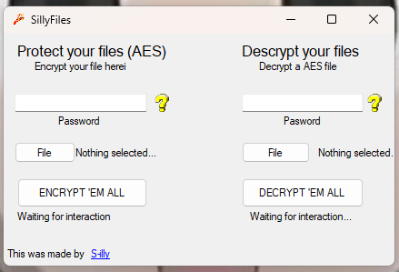

# SillyFiles
Basic and simple C# AES encryptor & decryptor
-  Encrypt your files with AES encryption and a password.
-  Decrypt your password-protected file.

# Media
Photos/Videos about the program
-  I will add more media as I update this repository.

# Information
About this repo :D
-  In case of any error or problem, do not hesitate to report it in Issues, and if you want to make changes or add more things, do not hesitate to add a pull request. Any help is welcome and appreciated :3 Thanks for reading btw
